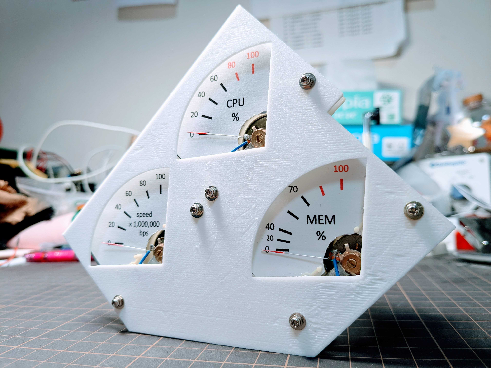

# comp_state_meter  
コンピュータ情報アナログメータ  

  

## 概要  
見ての通り、ビジュアル重視。  
タスクマネージャーで確認できる以下の情報を、アナログメーターで確認できるデバイス。  
* CPU使用率  
* メモリ使用率  
* ネットワーク速度  

車やバイクのメーターみたいに確認できたらカッコいいなと思い製作した。  
以下のようなこだわりがある。  
* レッドゾーン表記  
* メモリ使用率の0~40%までは間隔が狭い  
* ネットワーク速度のx1,000,000bps表記(タコのx1,000rpmを真似した)

## ハードウェア設計  
### 接続図  
ここに記載  

### 回路図  
2019年ごろに400円弱/個で買った電圧計(85C1？)を使用する。  
安さ故か1つ壊れていたので、修理して使用しており、抵抗を挟んでいる。  
ここに記載  

## ソフトウェア設計  
### PC側
ここに記載  

### デバイス側
ここに記載  